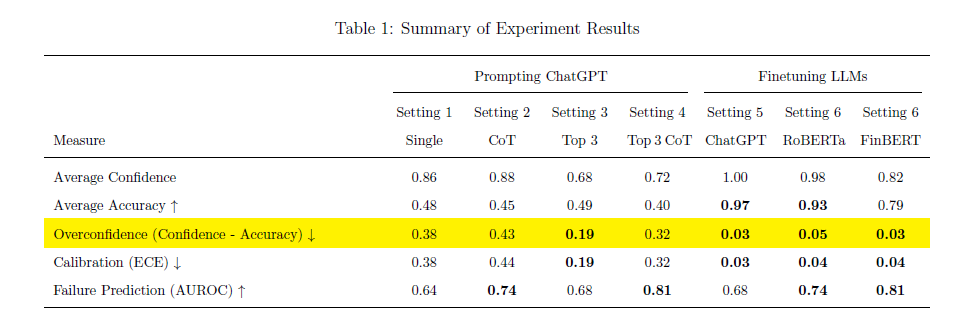

How Much Should We Trust LLM-Based Measures for Accounting and Finance Research? 
==
Code repository for the paper "How Much Should We Trust LLM-Based Measures for Accounting and Finance Research?"

Paper: [Add SSRN Link]

Author: [Minji Yoo] (The Wharton School, University of Pennsylvania)

## 01 Abstract

This paper investigates the reliability of self-reported confidence scores from large language models (LLMs) in the context of accounting and finance research. Researchers often ask ChatGPT to provide confidence levels for their predictions and use these scores to measure the likelihood that a sample is correctly labeled. This study evaluates their reliability by examining: 1) how well LLMs' expressed confidence aligns with their actual accuracy (calibration), and 2) how effectively these models distinguish between correct and incorrect predictions (failure prediction). To address these questions, I conduct experiments using ChatGPT on sentiment analysis of financial text, a common task in accounting and finance research. The results show a large 40\% difference between the average accuracy of predictions and the self-reported confidence scores under popular prompt strategies, indicating significant overconfidence. The paper proposes alternative methods to mitigate this issue. A modified prompt strategy from artificial intelligence literature reduces the overconfidence gap to 19\%, while a fine-tuning approach that directly retrieves the probability of predicted labels from the model, instead of relying on self-reported confidence scores, effectively eliminates overconfidence. Furthermore, smaller non-generative LLMs, such as RoBERTa, do not exhibit the overconfidence problem and outperform prompted ChatGPT in both calibration and failure prediction when finetuned. Finally, the paper demonstrates how empirical analysis can be influenced by the methods used to obtain confidence scores.

## 02 Quick Guide to Experiments

LLMs possess vast knowledge from pre-training, which is conducted prior to their release. However, like people starting a new job, LLMs require additional training to perform specific tasks effectively. There are two primary methods for this: prompt engineering and fine-tuning. Prompt engineering involves crafting specific questions to elicit optimal responses from a model. Fine-tuning, on the other hand, involves further training the model on a specific task using labeled training data. This paper investigates the problem of overconfidence in LLMs in particular, which occurs when they make figurative claims about their confidence levels during prompt engineering. Since accounting and finance researchers often use these self-reported confidence scores to estimate the likelihood that a sample is correctly labeled, ensuring their reliability is essential for accurate research outcomes.

First, I evaluate ChatGPT's calibration and failure prediction performance in prompt engineering settings that are commonly used for classification tasks in accounting and finance literature. 

**Setting 1: Single Prompt (scripts/benchmark_gpt.sh)** 
The most commonly used strategy is single prompting. This strategy simply asks a model to classify an input text and provide a confidence level or score along with the prediction. 

**Setting 2: Chain-of-Thought Prompt (scripts/cot_gpt.sh)** 
Another commonly used strategy is the chain-of-thought prompt strategy. This involves guiding the model to break down its reasoning process step by step, similar to showing its work when solving a problem (Kojima et al. [2022]).

Second, I test remedies for the overconfidence of LLMs as introduced in artificial intelligence and computer science literature. Tian et al. [2023] suggest that asking a model to provide multiple guesses (e.g., "Can you give me your top 3 guesses?") can make the model recognize the possibility of multiple options and distribute its confidence scores more evenly across different choices. Furthermore, Xiong et al. [2023] find that prompting the model multiple times with the same prompt and aggregating the responses leads to more stable and reliable performance. 

**Setting 3: Repeated Top-K Prompts (scripts/top_k_ensemble_gpt.sh)** 
I adopt repeated prompts with top-k guesses strategy following these suggestions. 

**Setting 4: Repeated Top-K + CoT Prompts (scripts/top_k_ensemble_gpt_cot.sh)** 
Additionally, I incorporate a chain-of-thought prompt into this strategy as another potential remedy for the overconfidence of LLMs.

Third, I explore fine-tuning as an alternative to prompt engineering for teaching LLMs how to perform classification tasks. Fine-tuning requires a quality training dataset, which may not always be available. However, it allows direct access to the calculated probability of the label from the model, rather than relying on the model's self-reported confidence. This calculated probability serves as the confidence score we can utilize as a measure.

**Setting 5: Finetuning Generative Models**
- Colab Notebook for finetuning ChatGPT (and Llama2) 
- Colab Notebook for testing finetuned models 

Fourth, I further explore non-generative models as an alternative to generative models such as ChatGPT. Overconfidence is a type of hallucination unique to generative models, as they are designed to create content and can sometimes fabricate information. In contrast, non-generative models are designed to condense information from texts rather than generate new content, thus avoiding hallucinations. While these models do not support dialog-based interactions and cannot be prompted, they can be efficiently fine-tuned with minimal resources. Therefore, fine-tuning non-generative models can be a cost-effective and more reliable option for researchers.

**Setting 6: Finetuning Non-generative Models**
- Colab Notebook for finetuning RoBERTa and FinBERT 
- Fine-tuned models can be found on my HuggingFace profile: 

**Note**: I am unable to share the fine-tuned ChatGPT model, as OpenAI retains ownership and it can only be accessed via their API.

## 03 Discussions on Llama2 (llama2-7b-chat-hf )

Llama 2 is an open-source generative LLM from Meta AI. In addition to ChatGPT, I also experimented with Llama 2 (7b-chat-hf model), but I chose not to report the results in the paper for the following reasons:

- The model does not consistently follow instructions.
- It suffers from repetition issues.
- The model is not large enough to effectively handle Chain-of-Thought prompting.
- Fine-tuning this model is resource-intensive.

A larger version of the model (e.g., 70b instead of 7b) might not encounter these issues, but 7b is already too large to run efficiently on a single high-spec GPU (NVIDIA A100 80G), particularly for fine-tuning. Therefore, there is no practical advantage to using this "open-source" model in this context.  

